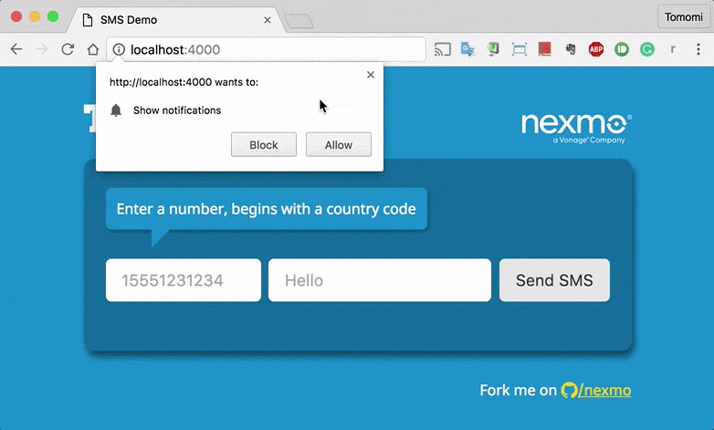

# Sending SMS from Web

This is a simple web app written in Node.js with Express.
Additionally, I am using W3C Web Notifications API for the front-end UI to show the SMS receipt message with Socket.io.



## Running This Demo Locally on Your Machine

### 1. Install dependencies

```bash
$ npm install
```

### 2. Set up a config.js with Your Credentials

Sign up at [Nexmo](https://nexmo.com) to get your own API keys and a virtual number.

Create `config.js` in `/server`. The file should include the credentials.

```javascript
var config = {
	api_key : '36c6bdab',
	api_secret : 'a32719d27d25ae9b',
  	number: '841659826645'
}

```

### 3. Run the Node App

```bash
$ node start
```

### 4. Launch it on Browser

Go to [http://localhost:4000](http://localhost:4000) and send text messages.
